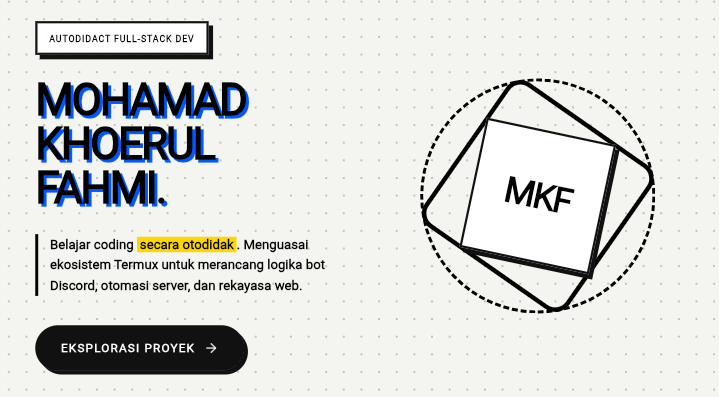

<div align="center">

# M.K Fahmi

Portfolio website built with React and Vite.



<br>

[Website](https://mifahmi.my.id) • [GitHub](https://github.com/MohFahmiMc)

</div>

---

## Overview

This repository contains the source code for my personal portfolio website.

The website serves as a central place to showcase projects, technical skills, development experience, and other work related to software development and technology.

Built with modern web technologies and optimized for performance, responsiveness, and maintainability.

---

## Tech Stack

| Technology | Purpose |
|------------|----------|
| React | User Interface |
| Vite | Build Tool |
| JavaScript | Application Logic |
| HTML5 | Structure |
| CSS3 | Styling |
| Vercel | Deployment & Hosting |

---

## Features

- Responsive design for desktop and mobile
- Modern portfolio layout
- Project showcase section
- Skills and technology stack display
- Contact and social links
- Fast loading performance
- SEO optimization
- Open Graph support for Discord and social media embeds
- Custom domain integration

---

## Project Structure

```text
MkFahmi/
│
├── public/
│   ├── favicon.png
│   └── preview.png
│
├── src/
│   ├── assets/
│   ├── components/
│   ├── pages/
│   ├── App.jsx
│   └── main.jsx
│
├── index.html
├── package.json
├── vite.config.js
├── README.md
└── .gitignore
```

---

## Local Development

Clone the repository:

```bash
git clone https://github.com/MohFahmiMc/MkFahmi.git
```

Navigate to the project directory:

```bash
cd MkFahmi
```

Install dependencies:

```bash
npm install
```

Start the development server:

```bash
npm run dev
```

Build for production:

```bash
npm run build
```

Preview the production build:

```bash
npm run preview
```

---

## Deployment

This project is deployed using Vercel.

Production URL:

```text
https://mifahmi.my.id
```

Any changes pushed to the main branch can be automatically deployed through Vercel.

---

## Repository Information

| Item | Value |
|--------|--------|
| Repository | MkFahmi |
| Owner | MohFahmiMc |
| Framework | React |
| Bundler | Vite |
| Hosting | Vercel |
| Domain | mifahmi.my.id |

---

## Goals

The purpose of this website is to:

- Present personal projects
- Showcase technical skills
- Build an online portfolio
- Share development work
- Create a professional online presence

---

## License

This project is available under the MIT License.

See the LICENSE file for more information.

---

<div align="center">

Maintained by **MohFahmiMc**

</div>
