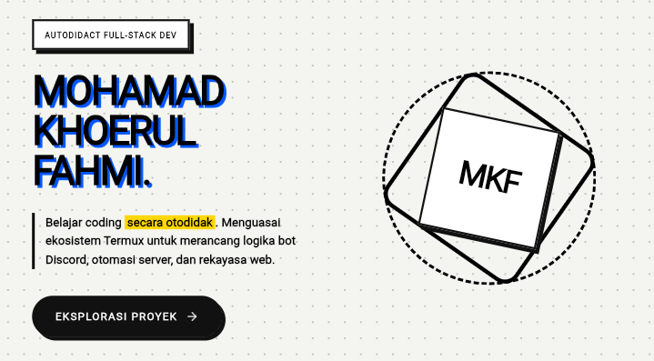

<div align="center">

# M.K Fahmi

Personal portfolio website built with **React** and **Vite**.



<p>
  <a href="https://mifahmi.my.id">Website</a> •
  <a href="https://github.com/MohFahmiMc">GitHub</a>
</p>

</div>

---

# Overview

This repository contains the source code for my personal portfolio website.

The website serves as a central place to showcase projects, technical skills, development experience, and other work related to software development and technology.

Built with modern web technologies, the project is optimized for performance, responsiveness, accessibility, and maintainability.

---

# Tech Stack

| Technology | Purpose |
| :--------- | :------ |
| React | User Interface |
| Vite | Build Tool |
| JavaScript | Application Logic |
| HTML5 | Structure |
| CSS3 | Styling |
| Vercel | Deployment & Hosting |
| `vercel.json` | SPA Client-side Routing Configuration |

---

# Features

- Responsive design for desktop and mobile
- Modern portfolio interface
- Project showcase
- Skills & technology stack
- Contact and social links
- Fast loading performance
- SEO optimization
- Open Graph support for Discord and social media embeds
- Custom domain support
- SPA routing fallback using `vercel.json`

---

# Project Structure

```text
MkFahmi/
│
├── public/
│   ├── favicon.png
│   └── preview.png
│
├── src/
│   ├── assets/
│   ├── components/
│   ├── pages/
│   ├── App.jsx
│   └── main.jsx
│
├── index.html
├── package.json
├── vercel.json
├── vite.config.js
├── README.md
└── .gitignore
```

---

# Local Development

Clone the repository:

```bash
git clone https://github.com/MohFahmiMc/MkFahmi.git
```

Move into the project directory:

```bash
cd MkFahmi
```

Install dependencies:

```bash
npm install
```

Run the development server:

```bash
npm run dev
```

Build for production:

```bash
npm run build
```

Preview the production build:

```bash
npm run preview
```

---

# Deployment

This project is deployed using **Vercel**.

### Production

```
https://mifahmi.my.id
```

## SPA Routing Configuration

To prevent **404 errors** when refreshing pages or directly opening nested routes, the project includes a **vercel.json** configuration file in the root directory.

```json
{
  "rewrites": [
    {
      "source": "/(.*)",
      "destination": "/index.html"
    }
  ]
}
```

This rewrite ensures that every request is served through `index.html`, allowing React Router (or any client-side router) to handle navigation correctly.

Every push to the **main** branch can be automatically deployed through Vercel.

---

# Repository Information

| Item | Value |
| :--- | :---- |
| Repository | MkFahmi |
| Owner | MohFahmiMc |
| Framework | React |
| Bundler | Vite |
| Hosting | Vercel |
| Domain | mifahmi.my.id |

---

# Goals

This website aims to:

- Showcase personal projects
- Highlight technical skills
- Build a professional online portfolio
- Share development work
- Provide an easy way to discover my work and experience

---

# License

This project is licensed under the **MIT License**.

See the **LICENSE** file for more information.

---

<div align="center">

**Maintained by MohFahmiMc**

</div>
